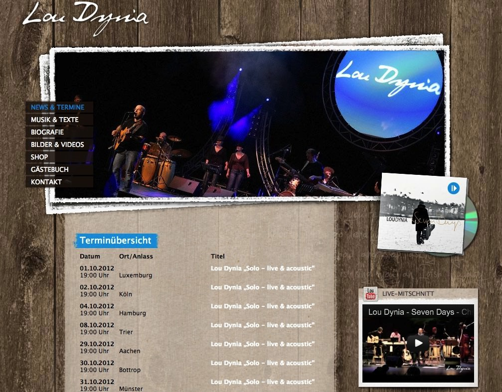
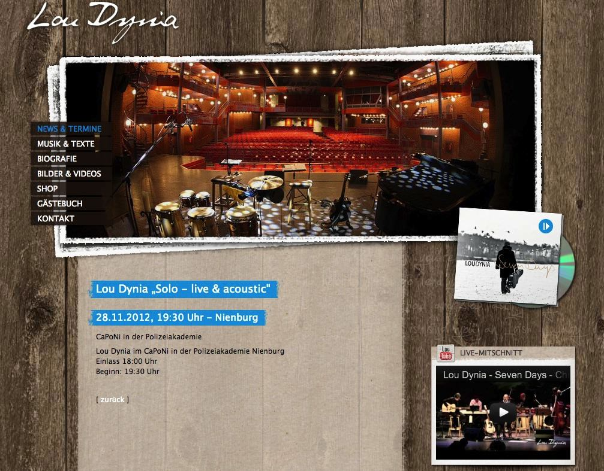

====================
Administrator Manual
====================

Target group: **Administrators**

Installation
============

Install the extension as normal in the Extension Manager. Depending on your TYPO3 version you will need to confirm the creation of the necessary database tables.

Configuration
=============

This extension is built using Extbase and Fluid. Thus the normal options of configuring storage folders or extracting the templates apply.

Adding the extension to a page gives you the choice of multiple output modes, namely „Upcoming Events“, „List of Events“ and „Calendar output“ and a „Details View“. The difference between the views is the way the events are being presented on the frontend.

Please note that the included default templates for the list mode and the upcoming mode are identical. You will not see a visual difference between these two modes unless you have more than 3 (or the configured amount) of events in your database.

All output options can be configured in the backend using flexforms. For the „Upcoming Events“ you can set the number of events to show (defaults to 3), for the „List of Events“ you can configure the number of years in the future you want to display. This defaults to one year which means that all events from today up to the same date one year from now will be displayed.

The following options are available for configuration by TypoScript:

plugin.tx\_gbevents.settings
^^^^^^^^^^^^^^^^^^^^^^^^^^^^

.. _holidays:

holidays
""""""""

.. container:: table-row

    Property
        holidays

    Data type
        array

    Description
        Define a global list of national holidays or dates on which no recurring events
        will occur. An entry on this list doesn't automaticall exclude events on these
        dates. This has to be activated bei either setting forceExcludeHolidays or
        ticking the respective checkbox within an event.

    Default
        National holidays for Germany 2014 & 2015

.. _forceExcludeHolidays:

forceExcludeHolidays
""""""""""""""""""""

.. container:: table-row

    Property
        forceExcludeHolidays

    Data type
        boolean

    Description
        Ignore the per event setting to exclude reccuring events on dates on the global
        exclusion list and forcefully prevent events to occur on these dates.

    Default
        false

detailsPid
""""""""""

.. container:: table-row

    Property
        detailsPid

    Data type
        integer

    Description
        Uid of the page where the details view of an event should link to. This needs to be incorporated
        into the template if you use your own templates. Normally set in the FlexForm config of the plugin.

    Default
        current page

displayMode
"""""""""""

.. container:: table-row

    Property
        displayMode

    Data type
        string

    Description
        One of the values ``list``, ``archive`` or ``calendar``. This settings defines the initial output
        of the extension when not using one of the dedicated plugins. Normally set in the FlexForm config
        of the plugin. This setting is deprecated and will be removed with version 8.

    Default
        list

limit
"""""

.. container:: table-row

    Property
        limit

    Data type
        integer

    Description
        Defines the number of events being shown in the upcoming events view. Normally set in the FlexForm config
        of the plugin.

    Default
        3

years
"""""

.. container:: table-row

    Property
        years

    Data type
        integer

    Description
        Number of years for which the next events will be retrieved/calculated. Normally set in the FlexForm config
        of the plugin.

    Default
        1

startDateOnly
"""""""""""""

.. container:: table-row

    Property
        startDateOnly

    Data type
        boolean

    Description
        Flag to toggle if days spanning multiple days will be displayed on each day of the event.
        Setting this flag shows the event only on the first day of the events, once this day has
        passed the events will not show up in the list views anymore.
        Normally set in the FlexForm config of the plugin.

    Default
        false

showStartedEvents
"""""""""""""""""

.. container:: table-row

    Property
        showStartedEvents

    Data type
        boolean

    Description
        Flag to toggle if events which span multiple days will be shown in the list views until the
        last day of the event has passed. This toggle only has an effect when ``startDateOnly`` has
        been enabled, otherwise the event will be shown on separately on each day of the event.
        Normally set in the FlexForm config of the plugin.

    Default
        false

Output Modes
============

    Frontend view of upcoming events

    Example implementation of the frontend output for the upcoming events.

    Frontend list view of events in the database

    Example implementation of the list view frontend output.

    Frontend details view of an event

    Example implementation of the details view for an event.

Customization
=============

This extension is built using Extbase and Fluid. Thus the normal options of configuring storage folders or extracting the templates apply.
Unless you configured the storage folder using TypoScript don't forget to set the Record Storage option to the folder where you have added the event records.
