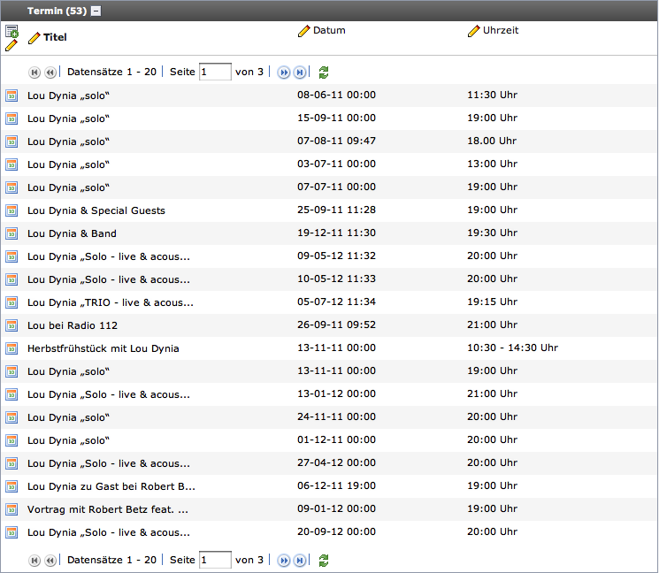
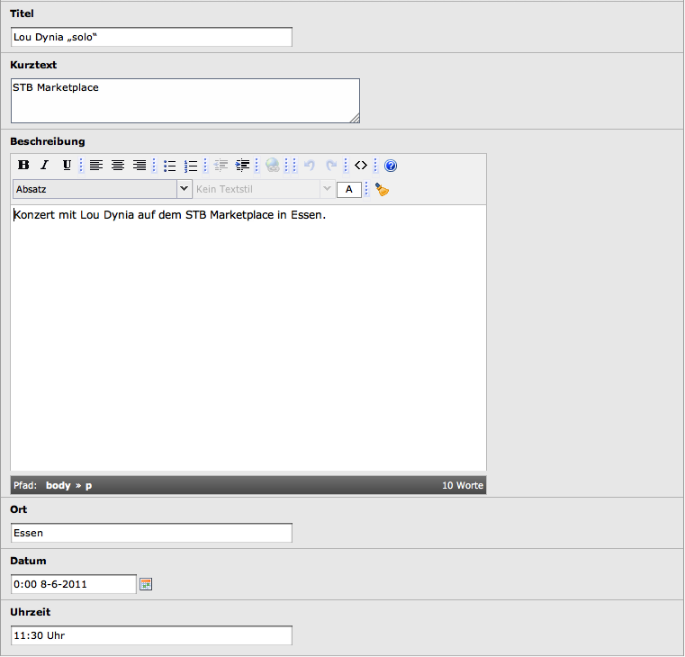

============
Users manual
============

Target group: **Editors**

After the extension has been installed use the list mode to add event records to a Sysfolder.
You need to supply a title, abstract and description of the event as well as place, date and time.
On the second tab you can configure if the event should be recurring by selecting the weeks of a month and the days of the week.

		Default Backend view for event records

		The Backend view of TYPO3 listing event records on a page/in a folder.

    Default Backend view for editing event records

    The Backend view of TYPO3 for editing a single event.
